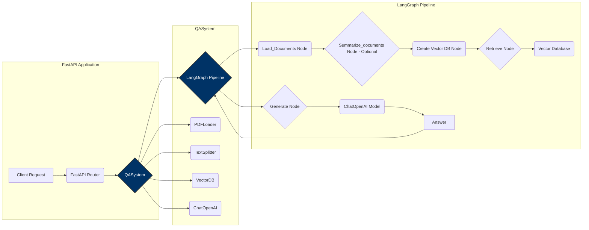
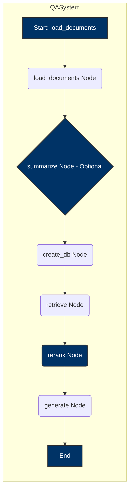

## Zania QA API - Langraph

* **Multi-Document Question Answering:** Extending the system to answer questions across multiple documents, potentially summarizing or reranking them for improved accuracy.

### Diagram of Code Architecture



### Graph Diagram



## Coding Architecture

The system follows a layered architecture designed for modularity, flexibility, and maintainability:

*   **FastAPI Application:**  The entry point for client requests.
    *   `Client Request`: Receives incoming requests.
    *   `FastAPI Router`: Routes requests to the `QASystem`.

*   **QASystem:** Orchestrates the entire question answering process.
    *   Leverages a `LangGraph Pipeline` to define the workflow.
    *   Utilizes:
        *   `PDFLoader`: Loads PDF documents.
        *   `TextSplitter`: Splits documents into manageable chunks.
        *   `VectorDB`: Manages the vector database for semantic search.
        *   `ChatOpenAI`: Generates answers using a language model.

*   **LangGraph Pipeline:** Defines the steps for answering a question.
    *   `Load_Documents Node`: Load the Documents
    *   `Summarize_documents Node (Optional)`: Summarizes the documents, to improve the speed and to decrease token usage.
    *   `Create Vector DB Node`: Creates a Vector DB from documents or summaries.
    *   `Retrieve Node`: Retrieves relevant document chunks from the Vector Database.
    *   `Rerank Node`: Reranks document chunks to select the most relevant.
    *   `Generate Node`: Generates the final answer using the language model based on the content received from prompts.

The `QASystem` and `LangGraph Pipeline` layers are styled in dark blue (`#003366`) to highlight their core role in the question answering process. The architecture prioritizes modularity through the separation of responsibilities and the use of well-defined interfaces.

## System Architecture

* Using `FastAPI` as backend, which is `reliable` and `robust`.
* After that doing `containerization` with `Docker`, which is further easy to scale.
* If we want to scale we can add `Load balancers` by adding `nginx` container, we can easily create `replicas`, by
  transforming it into `Multi Container Architecture` using `Docker compose`.

## Input Schema for route `/` - POST request

```
{
  "query": ["What is the name of the company?",
    "Who is the CEO of the company?",
    "What is their vacation policy?",
    "What is the termination policy?",
    "Please provide an Overview of OOPs principles?"]

}
```

## Output Schema

```
[
  {
    "question": "What is the name of the company?",
    "answer": "The name of the company is Zania, Inc."
  },
  {
    "question": "Who is the CEO of the company?",
    "answer": "The CEO of the company is Shruti Gupta."
  },
  {
    "question": "What is their vacation policy?",
    "answer": "The vacation policy states that the company will generally grant requests for vacation when possible, taking business needs into consideration. When multiple employees request the same time off, their length of employment, seniority, or collective-bargaining agreement may determine priority in scheduling vacation times. Employees must take vacation in increments of at least a specified number of hours or days.\n\nDuring a leave of absence, the company may require employees to use any unused vacation during disability or family medical leave, or any other leave of absence, where permissible under local, state, and federal law. \n\nVacation granted during the first year of employment will be prorated based on the hire date. Eligible employees will accrue a specified number of hours, days, or weeks of vacation for every period of time worked, up to a maximum accrual amount. Once the maximum accrual amount is reached, employees will not accrue additional vacation until they use some of the accrued but unused vacation.\n\nEmployees are encouraged to use their vacation time and are eligible to begin using it immediately upon hire or after completing their introductory period. Requests for vacation must be made to the manager as far in advance as possible, but at least a specified number of days or weeks in advance."
  },
  {
    "question": "What is the termination policy?",
    "answer": "The termination policy states that employment is on an \"at-will\" basis, meaning that either the employee or the employer can terminate the employment at any time. The specific terms of the employment relationship, including termination procedures, are governed by the laws of the state in which the employee is employed. In appropriate circumstances, management may provide a verbal warning followed by written warnings, and if the conduct does not improve, it may lead to demotion, transfer, forced leave, or termination. However, the company is not obligated to follow any disciplinary or grievance procedure and may discipline or terminate employees without prior warning or procedure. Violating company policies may also result in immediate termination."
  },
  {
    "question": "Please provide an Overview of OOPs principles?",
    "answer": "I am sorry, but the provided context does not contain the answer to the question."
  }
]
```

## Deployment Instructions

1. clone the `repo`.
2. Place `.env` in root of folder.
3. Place `handbook.pdf` in `fixtures` folder.

### Execute API using Docker

```bash
docker build -t zania_qa_api .
docker run -p 5001:5001 -m 1G zania_qa_api
```

### Execute API using virtual environments

```bash
cd Zania_QA_API/
python3 -m venv venv
# Linux
source venv/bin/activate
# windows
.\venv\Scripts\activate.bat

pip install --no-cache-dir -r requirements.txt

python app.py
```

## CURL Request

```bash

curl -X 'POST' \
  'http://0.0.0.0:5001/answer_question' \
  -H 'accept: application/json' \
  -H 'Content-Type: application/json' \
  -d '{
  "query": ["What is the name of the company?",
"Who is the CEO of the company?",
"What is their vacation policy?",
"What is the termination policy?",
"Please provide an Overview of OOPs principles?"]}'
```

## Future Use Cases

LangGraph's flexibility allows for many complex future enhancements. Here are a few examples:

*   **Multi-Document Question Answering:** Extending the system to answer questions across multiple documents, potentially summarizing or reranking them for improved accuracy.
*   **Conversational Question Answering:** Implementing memory to handle follow-up questions and maintain context within a conversation.
*   **Question Decomposition:** Breaking down complex questions into simpler sub-questions that can be answered individually and then synthesized.
*   **Dynamic Tool Use:** Integrating external tools (e.g., a calculator, web search) to provide more comprehensive answers.
*   **Improved Error Handling:** Implementing robust error handling and retry mechanisms to improve the system's resilience.
*   **Multi-Lingual Support:** Adding support for multiple languages through translation and language-specific LLMs.