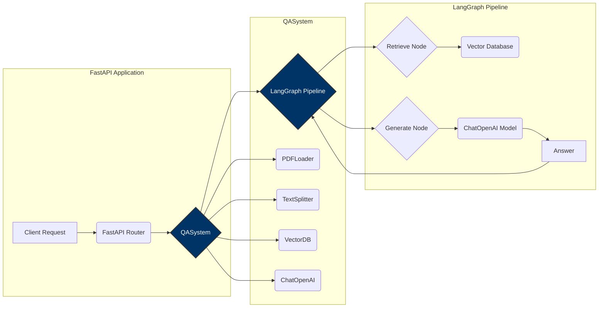
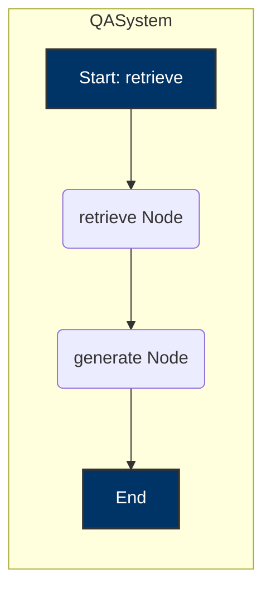

## Zania QA API - Langraph

* Creating a robust and scalable QA microservice

### Diagram of Code Architecture



### Graph Diagram



## Code Architecture

* In Code Architecture, we are following `OOPS` and `SOLID5` principles to make code more efficient
  `modular, flexible, extensible, scalable`.
* Usually, `open source repos` follow this [principles](https://realpython.com/solid-principles-python/), `SRP` and
  `DIP` are widely used.
* Key Components and Design:
    * **Abstract Base Classes (ABCs):**  We utilize abstract base classes (`AbstractPDFLoader`, `AbstractTextSplitter`,
      `AbstractVectorDB`) to define interfaces for key components. This promotes the Dependency Inversion Principle (
      DIP), allowing high-level modules to depend on abstractions rather than concrete implementations.
    * **Dependency Injection:**  The `QASystem` class receives instances of these abstract classes through its
      constructor, enabling loose coupling and making it easy to swap out different implementations (e.g., a different
      PDF loader or text splitter).
    * **LangGraph for Orchestration:** LangGraph is employed to define the question answering pipeline as a directed
      graph.
        * `GraphState`: Defines the state managed by the graph (query, documents, answer, etc.).
        * `retrieve` and `generate` Nodes: These functions represent individual steps in the QA process, making the code
          modular and easier to test.
* Using `ThreadPoolExecutor` for concurrent processing for making parallel calls and getting results faster.

## System Architecture

* Using `FastAPI` as backend, which is `reliable` and `robust`.
* After that doing `containerization` with `Docker`, which is further easy to scale.
* If we want to scale we can add `Load balancers` by adding `nginx` container, we can easily create `replicas`, by
  transforming it into `Multi Container Architecture` using `Docker compose`.

## Input Schema for route `/` - POST request

```
{
  "query": ["What is the name of the company?",
    "Who is the CEO of the company?",
    "What is their vacation policy?",
    "What is the termination policy?",
    "Please provide an Overview of OOPs principles?"]

}
```

## Output Schema

```
[
  {
    "question": "What is the name of the company?",
    "answer": "The name of the company is Zania, Inc."
  },
  {
    "question": "Who is the CEO of the company?",
    "answer": "The CEO of the company is Shruti Gupta."
  },
  {
    "question": "What is their vacation policy?",
    "answer": "The vacation policy states that the company will generally grant requests for vacation when possible, taking business needs into consideration. When multiple employees request the same time off, their length of employment, seniority, or collective-bargaining agreement may determine priority in scheduling vacation times. Employees must take vacation in increments of at least a specified number of hours or days.\n\nDuring a leave of absence, the company may require employees to use any unused vacation during disability or family medical leave, or any other leave of absence, where permissible under local, state, and federal law. \n\nVacation granted during the first year of employment will be prorated based on the hire date. Eligible employees will accrue a specified number of hours, days, or weeks of vacation for every period of time worked, up to a maximum accrual amount. Once the maximum accrual amount is reached, employees will not accrue additional vacation until they use some of the accrued but unused vacation.\n\nEmployees are encouraged to use their vacation time and are eligible to begin using it immediately upon hire or after completing their introductory period. Requests for vacation must be made to the manager as far in advance as possible, but at least a specified number of days or weeks in advance."
  },
  {
    "question": "What is the termination policy?",
    "answer": "The termination policy states that employment is on an \"at-will\" basis, meaning that either the employee or the employer can terminate the employment at any time. The specific terms of the employment relationship, including termination procedures, are governed by the laws of the state in which the employee is employed. In appropriate circumstances, management may provide a verbal warning followed by written warnings, and if the conduct does not improve, it may lead to demotion, transfer, forced leave, or termination. However, the company is not obligated to follow any disciplinary or grievance procedure and may discipline or terminate employees without prior warning or procedure. Violating company policies may also result in immediate termination."
  },
  {
    "question": "Please provide an Overview of OOPs principles?",
    "answer": "I am sorry, but the provided context does not contain the answer to the question."
  }
]
```

## Deployment Instructions

1. clone the `repo`.
2. Place `.env` in root of folder.
3. Place `handbook.pdf` in `fixtures` folder.

### Execute API using Docker

```bash
docker build -t zania_qa_api .
docker run -p 5001:5001 -m 1G zania_qa_api
```

### Execute API using virtual environments

```bash
cd Zania_QA_API/
python3 -m venv venv
# Linux
source venv/bin/activate
# windows
.\venv\Scripts\activate.bat

pip install --no-cache-dir -r requirements.txt

python app.py
```

## CURL Request

```bash

curl -X 'POST' \
  'http://0.0.0.0:5001/answer_question' \
  -H 'accept: application/json' \
  -H 'Content-Type: application/json' \
  -d '{
  "query": ["What is the name of the company?",
"Who is the CEO of the company?",
"What is their vacation policy?",
"What is the termination policy?",
"Please provide an Overview of OOPs principles?"]}'
```

## Future Use Cases

LangGraph's flexibility allows for many complex future enhancements. Here are a few examples:

*   **Conversational Question Answering:** Implementing memory to handle follow-up questions and maintain context within a conversation.
*   **Question Decomposition:** Breaking down complex questions into simpler sub-questions that can be answered individually and then synthesized.
*   **Dynamic Tool Use:** Integrating external tools (e.g., a calculator, web search) to provide more comprehensive answers.
*   **Multi-Lingual Support:** Adding support for multiple languages through translation and language-specific LLMs.