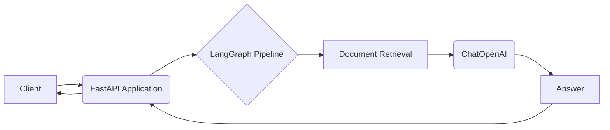
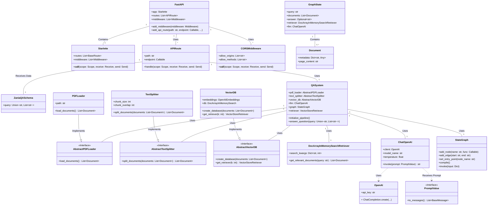
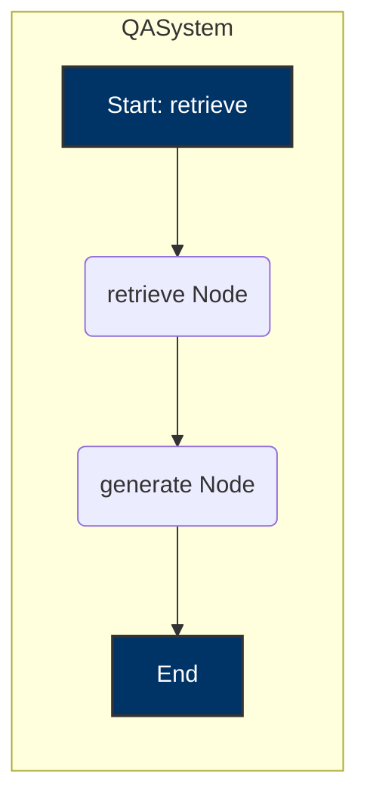

## Zania QA API - Langraph

* Creating a robust and scalable QA microservice


### High-Level Diagram




### Low - level Diagram






## Code Architecture

* In Code Architecture, we are following `OOPS` and `SOLID5` principles to make code more efficient `modular, flexible, extensible, scalable`.
* Usually `open source repos` follow this [principles](https://realpython.com/solid-principles-python/), `SRP` and `DIP` are widely used.
* Coding steps
  1. Loading `PDF` -> Creating `PDFLoader` class, following `SRP (Single Responsibility Principle)`
  2. Converting documents into `small chunks`, -> Creating `TextSplitter` class for that. following `SRP (Single Responsibility Principle)`
  3. Creating `In Memory vector DB`. --> Creating `VectorDB` class for that, following `SRP (Single Responsibility Principle)`
  4. finally, creating `QASystem` Class, and following `Facade Pattern, DIP (Dependency Inversion Principle)`, and `integrating 3 previous classes` and creating `answer_question function` in QASystem as single entry point.

* Using `ThreadPoolExecutor` for concurrent processing for making parallel calls, getting results faster.


## System Architecture

* Using `FastAPI` as backend, which is `reliable` and `robust`.
* After that doing `containerization` with `Docker`, which is further easy to scale.
* If we want to scale we can add `Load balancers` by adding `nginx` container, we can easily create `replicas`, by transforming it into `Multi Container Architecture` using `Docker compose`. 


## Input Schema for route `/` - POST request


```
{
  "query": ["What is the name of the company?",
    "Who is the CEO of the company?",
    "What is their vacation policy?",
    "What is the termination policy?",
    "Please provide an Overview of OOPs principles?"]

}
```
## Output Schema


```
{
  "answer": [
    {
      "question": "What is the name of the company?",
      "answer": "The name of the company is Zania, Inc."
    },
    {
      "question": "Who is the CEO of the company?",
      "answer": "The CEO of the company is Shruti Gupta."
    },
    {
      "question": "What is their vacation policy?",
      "answer": "The company generally grants requests for vacation when possible, taking business needs into consideration. When multiple employees request the same time off, their length of employment, seniority, or collective-bargaining agreement may determine priority in scheduling vacation times. Employees must take vacation in increments of at least a specified number of hours or days. \n\nDuring a leave of absence, the company may require employees to use any unused vacation during disability or family medical leave, or any other leave of absence, where permissible under local, state, and federal law. \n\nUnused vacation can typically be carried over to the following year, but specific conditions for carryover may apply. Employees will accrue vacation based on a specified amount for every period of time worked, up to a maximum accrual amount. Once the maximum accrual is reached, no additional vacation will accrue until some of the accrued but unused vacation is used.\n\nEmployees are encouraged to use their vacation time and are eligible to begin using it immediately upon hire or after a specified introductory period. Requests for vacation should be made to the manager as far in advance as possible, but at least a specified number of days or weeks in advance."
    },
    {
      "question": "What is the termination policy?",
      "answer": "The termination policy states that employment is on an \"at-will\" basis, meaning that either the employee or the company can terminate the employment relationship at any time. In appropriate circumstances, management may provide a verbal warning followed by written warnings, and if the conduct does not improve, it may lead to demotion, transfer, forced leave, or termination. However, the company is not obligated to follow any specific disciplinary or grievance procedure and may discipline or terminate employees without prior warning or procedure, depending on the circumstances. Violations of company policies may result in disciplinary action, including immediate termination."
    },
    {
      "question": "Please provide an Overview of OOPs principles?",
      "answer": "I don't know."
    }
  ]
}
```

## Deployment Instructions

1. clone the `repo`.
2. Place `.env` in root of folder.
3. Place `handbook.pdf` in `fixtures` folder.

### Execute API using Docker

```bash
docker build -t zania_qa_api .
docker run -p 5001:5001 -m 1G zania_qa_api
```

### Execute API using virtual environments


```bash
cd Zania_QA_API/
python3 -m venv venv
# Linux
source venv/bin/activate
# windows
.\venv\Scripts\activate.bat

pip install --no-cache-dir -r requirements.txt

python app.py
```

## CURL Request

```bash

curl -X 'POST' \
  'http://0.0.0.0:5001/answer_question' \
  -H 'accept: application/json' \
  -H 'Content-Type: application/json' \
  -d '{
  "query": ["What is the name of the company?",
"Who is the CEO of the company?",
"What is their vacation policy?",
"What is the termination policy?",
"Please provide an Overview of OOPs principles?"]}'
```